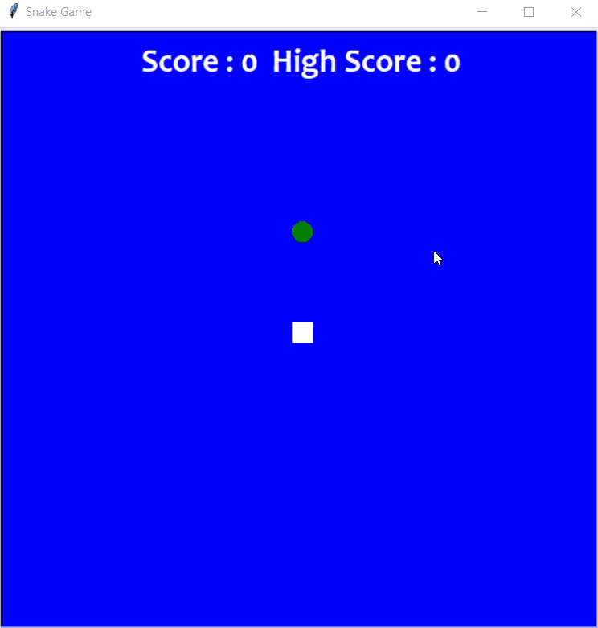

# Python_Mini_Project

<!-- Social Links -->

[![LinkedIn][linkedin-shield]][linkedin-url]
[![Instagram][instagram-shield]][instagram-url]
[![Hashnode][hashnode-shield]][hashnode-url]

> # All About `Games using Pygame` 😎

># Designed With 😇
>## TECHNOLOGIES USED 
>
>## Making Use of Tools
>
>
>
>

# HERE IS THE PREVIEW HOW THIS PROJECT LOOKS😍
>
>

>## For any query you can reach out at brijeshvadaliya1@gmail.com I am happy to help 😎

# HAPPY LEARNING 🤩
>
>## The joy of coding Python should be in seeing short, concise, readable classes that express a lot of action in a small amount of clear code -- not in reams of trivial code that bores the reader to death.

<!-- Linkedin -->

[linkedin-shield]: https://img.shields.io/badge/-LinkedIn-black.svg?style=for-the-badge&logo=linkedin&colorB=0B5FBB
[linkedin-url]: https://www.linkedin.com/in/brijesh-vadaliya-16b3a2202/

<!-- Instagram -->

[instagram-shield]: https://img.shields.io/badge/Instagram-%23E4405F.svg?style=for-the-badge&logo=Instagram&logoColor=white
[instagram-url]: https://www.instagram.com/brijesh_vadaliya_8128/

<!-- Hashnode -->

[hashnode-shield]: https://img.shields.io/badge/Hashnode-2962FF?style=for-the-badge&logo=hashnode&logoColor=white
[hashnode-url]: https://brijeshvadaliya8128.hashnode.dev/
